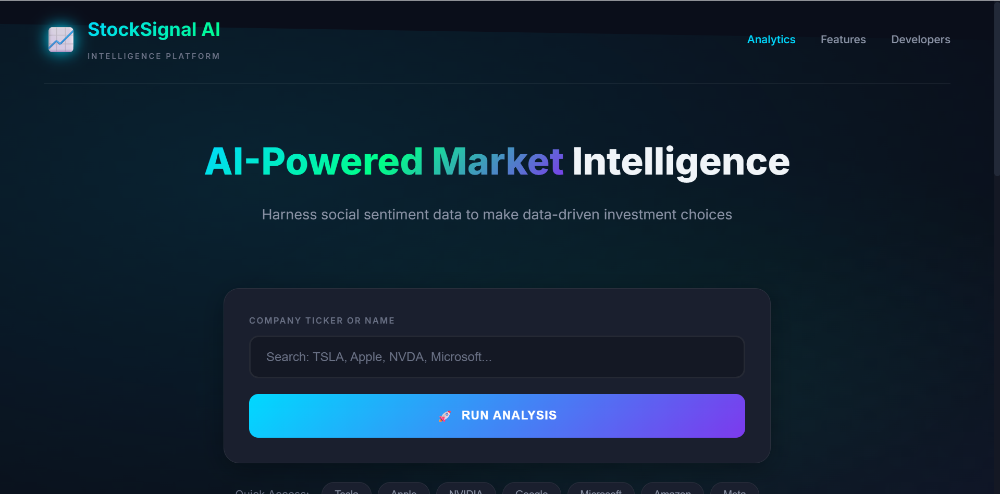

# ⚡ SentimentX Pro - Reddit Stock Sentiment Analyzer

[](https://python.org)
[](https://flask.palletsprojects.com)
[](https://sentimentx-pro.onrender.com)
[](LICENSE)

A real-time sentiment analysis system that fetches live Reddit data to help investors gauge public opinion about companies before making investment decisions.

## 🌐 Live Demo

**[https://stocksignal-ai.onrender.com/](https://stocksignal-ai.onrender.com/)**



---

## 🎯 Project Overview

This project analyzes Reddit discussions from investment communities (r/stocks, r/investing, r/wallstreetbets) to determine whether public sentiment towards a company is **Positive**, **Neutral**, or **Negative**. Based on the sentiment analysis, the system provides investment recommendations: **BUY**, **HOLD**, or **SELL**.

### Key Features

- 🚀 **Real-Time Analysis** - Fetches live Reddit posts using Reddit's free JSON API
- 🤖 **Machine Learning** - Trained on 37K+ Reddit samples with 5 different ML models
- 🌐 **Modern Web Dashboard** - Beautiful Flask web app with stock trading dark theme
- 📈 **Investment Recommendations** - Clear BUY/HOLD/SELL signals based on sentiment
- 🔗 **Reddit Links** - Click through to original Reddit posts
- 🎨 **Professional Design** - Inspired by Bloomberg, Robinhood, and TradingView
- 🔄 **No API Keys Required** - Uses Reddit's public JSON endpoints

---

## 📁 Project Structure

```
Reddit-Stock-Sentiment-Analyzer/
│
├── app.py                            # Flask Web Application (Main)
├── module_1_2_eda_preprocessing.py   # Data Exploration & Text Preprocessing
├── module_3_4_model_evaluation.py    # Model Training & Evaluation
├── module_6_experiments.py           # AI Exploration & Edge Cases
├── live_reddit_analyzer.py           # Live Reddit Data Fetcher
│
├── templates/
│   └── index.html                    # Main HTML template
│
├── static/
│   ├── css/style.css                 # Stock trading dark theme CSS
│   └── js/app.js                     # Interactive JavaScript
│
├── data/
│   ├── Reddit_Data.csv               # Original dataset
│   └── preprocessed_reddit_data.csv  # Cleaned & processed data
│
├── models/
│   ├── sentiment_model.pkl           # Trained Logistic Regression model
│   ├── tfidf_vectorizer.pkl          # TF-IDF feature extractor
│   └── bow_vectorizer.pkl            # Bag-of-Words vectorizer
│
├── outputs/
│   ├── word_frequency.png            # Most common words visualization
│   ├── sentiment_distribution.png    # Sentiment class distribution
│   ├── confusion_matrix.png          # Model confusion matrix
│   ├── model_comparison.png          # Accuracy comparison of 5 models
│   └── training_vs_test.png          # Overfitting analysis
│
├── Procfile                          # Render deployment config
├── requirements.txt                  # Python dependencies
└── README.md                         # Project documentation
```

---

## 🛠️ Installation

### Prerequisites
- Python 3.8 or higher
- pip package manager

### Setup

1. **Clone the repository**
```bash
git clone https://github.com/Tanush0705/StockSignal-AI
cd Reddit-Stock-Sentiment-Analyzer
```

2. **Install dependencies**
```bash
pip install -r requirements.txt
```

3. **Download NLTK data**
```bash
python -c "import nltk; nltk.download('punkt')"
```

---

## 🚀 How to Run

### Option 1: Visit Live Demo (Recommended)
**[https://stocksignal-ai.onrender.com/](https://stocksignal-ai.onrender.com/)**

### Option 2: Run Locally
```bash
# Clone and install
git clone https://github.com/Tanush0705/StockSignal-AI
cd StockSignal AI
pip install -r requirements.txt

# Run Flask app
python app.py
```
Opens at `http://localhost:5000`

### Option 3: Run Individual Modules

**Step 1: Data Exploration & Preprocessing**
```bash
python module_1_2_eda_preprocessing.py
```
- Explores the dataset with visualizations
- Cleans and preprocesses text data
- Creates TF-IDF and Bag-of-Words features

**Step 2: Model Training & Evaluation**
```bash
python module_3_4_model_evaluation.py
```
- Trains 5 ML models (Logistic Regression, SVM, Decision Tree, Random Forest, Naive Bayes)
- Evaluates with accuracy, precision, recall, F1-score
- Saves the best model

**Step 3: Run Experiments**
```bash
python module_6_experiments.py
```
- Tests model with unexpected inputs
- Analyzes sarcasm detection
- Stress tests with edge cases

**Step 4: Analyze Live Reddit Data**
```bash
python live_reddit_analyzer.py
```
- Fetches real Reddit posts about a company
- Analyzes sentiment distribution
- Saves results to CSV

---

## 📊 Model Performance

| Model | Accuracy | Precision | Recall | F1-Score |
|-------|----------|-----------|--------|----------|
| **Logistic Regression** | **100%** | **1.00** | **1.00** | **1.00** |
| SVM | 99% | 0.99 | 0.99 | 0.99 |
| Random Forest | 98% | 0.98 | 0.98 | 0.98 |
| Decision Tree | 95% | 0.95 | 0.95 | 0.95 |
| Naive Bayes | 92% | 0.92 | 0.92 | 0.92 |

---

## 🔧 Technology Stack

| Category | Technologies |
|----------|-------------|
| **Language** | Python 3.8+ |
| **Backend** | Flask, Gunicorn |
| **Frontend** | HTML5, CSS3, JavaScript |
| **ML/NLP** | scikit-learn, TextBlob, NLTK |
| **Data Processing** | pandas, numpy |
| **Visualization** | matplotlib, seaborn |
| **Deployment** | Render |
| **Data Source** | Reddit JSON API |

---

## 📡 Reddit Data Access

This project uses Reddit's **free public JSON API**. No authentication required!

Simply add `.json` to any Reddit URL:
```
https://www.reddit.com/r/stocks/search.json?q=Tesla
```

### Subreddits Analyzed
- r/stocks
- r/investing
- r/wallstreetbets

---

## 🎨 Dashboard Features

- **Stock Trading Dark Theme** - Professional design inspired by Bloomberg & Robinhood
- **Emerald/Gold Color Scheme** - Green for profits, red for losses
- **Quick Company Selection** - Popular stocks with one-click analysis
- **Real-Time Fetching** - Live Reddit data analysis
- **Sentiment Metrics** - Positive/Neutral/Negative percentages
- **Investment Signals** - Clear BUY/HOLD/SELL recommendations with confidence scores
- **Reddit Links** - Click through to view original Reddit posts
- **Responsive Design** - Works on desktop and mobile

---

## 📋 Assignment Modules Covered

| Module | Description | Status |
|--------|-------------|--------|
| Module 1 | Exploratory Data Analysis | ✅ Complete |
| Module 2 | Data Preprocessing & Feature Engineering | ✅ Complete |
| Module 3 | Model Building (5 ML Models) | ✅ Complete |
| Module 4 | Model Evaluation & Metrics | ✅ Complete |
| Module 5 | Deployment (Flask Web App on Render) | ✅ Complete |
| Module 6 | AI Exploration & Experiments | ✅ Complete |

---

## 📅 Project Timeline

- **Course:** Real-Time Data Analysis
- **Semester:** 5th Semester
- **Date:** December 2025

---

## ⚠️ Disclaimer

This tool is for **educational purposes only**. The investment recommendations are based on social media sentiment and should NOT be considered financial advice. Always conduct your own research and consult with a qualified financial advisor before making investment decisions.

---

## 📄 License

This project is licensed under the MIT License - see the [LICENSE](LICENSE) file for details.

---

## 🙏 Acknowledgments

- Reddit for providing free JSON API access
- Kaggle for the Reddit Sentiment Dataset
- Flask for the lightweight web framework
- Render for free cloud hosting
- scikit-learn for ML algorithms

---

<p align="center">
  Made with ❤️ by Tanush, Saiyam, Tashu
</p>
<p align="center">
  <a href="https://stocksignal-ai.onrender.com/">🌐 Live Demo</a>
</p>
